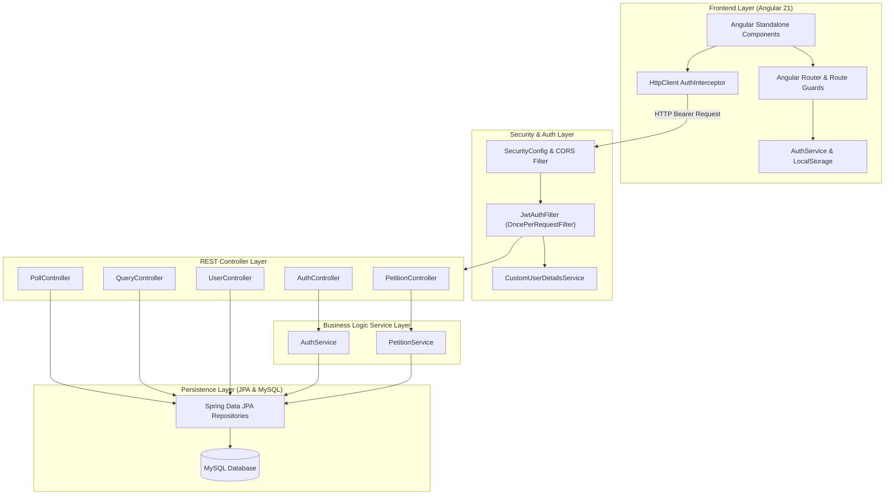
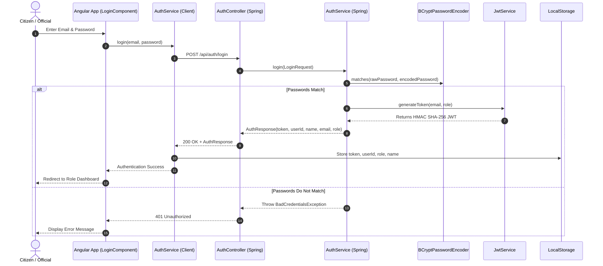
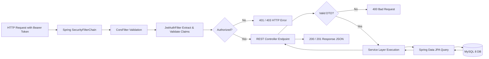
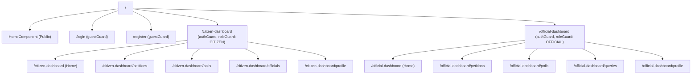
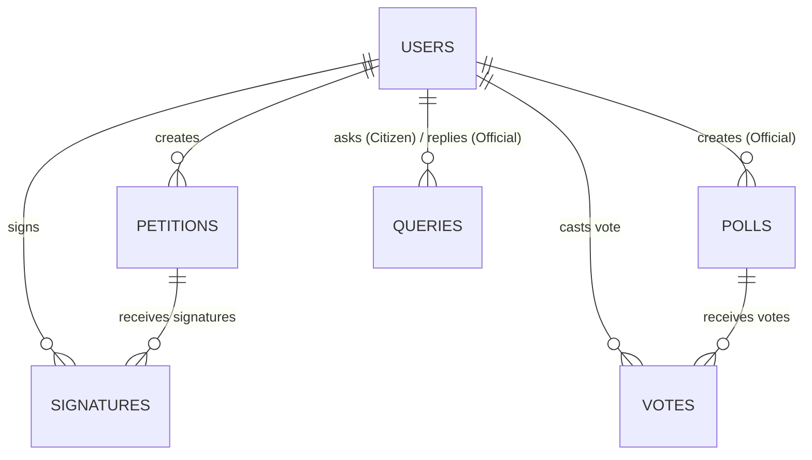

# CIVIX PLATFORM - SYSTEM ARCHITECTURE & DIAGRAMS

---

## 1. SYSTEM ARCHITECTURE

---

## 2. AUTHENTICATION FLOW

---

## 3. REQUEST LIFECYCLE

---

## 4. FRONTEND ROUTING MAP

---

## 5. DATABASE RELATIONS

